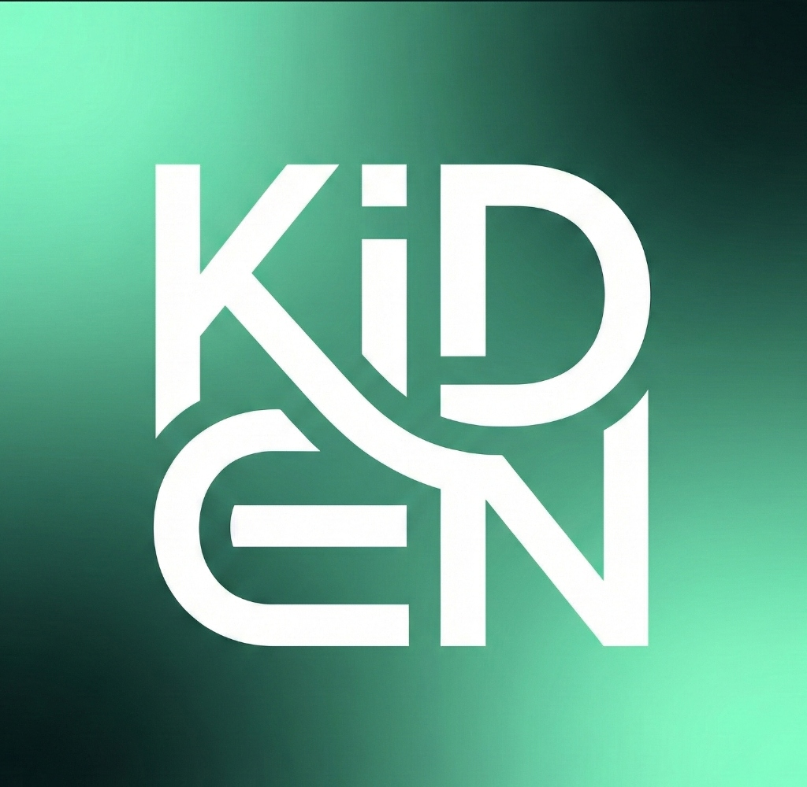

# Kiden Hub

<div align="center">
  
  <br />
  <h3>The Ultimate Productivity Workspace for Developers</h3>
  <p>Focus, Organize, and Track your growth in one seamless interface.</p>
</div>

---

## 🚀 Overview

**Kiden Hub** is a modern, privacy-focused productivity suite designed to help you master your workflow. It combines task management, habit tracking, focused work sessions, and developer tools into a unified, aesthetically pleasing dashboard. Built with a "Guest First" philosophy, it offers robust local persistence alongside Supabase cloud synchronization.

## ✨ Key Features

### 🧠 **Focus Mode**
- Built-in **Pomodoro Timer** with customizable work/break intervals.
- **Deep Work Analytics**: Track weekly and monthly focus hours.
- **Streak Tracking**: Maintain your momentum with daily streak visualizations.
- **Zen UI**: Minimalist interface to eliminate distractions.

### ✅ **Task Command Center**
- **Kanban Board**: Drag-and-drop task management.
- **Priority System**: Categorize tasks by urgency (Urgent, High, Normal, Low).
- **Deadlines**: Visual indicators for due dates.
- **Guest Support**: Tasks persist locally even without an account.

### 📈 **Analytics Dashboard**
- **Real-Time Charts**: Visualize your activity flow and task completion rates.
- **Consistency Grid**: GitHub-style heatmap for habit tracking.
- **Distribution Analysis**: Breakdown of time spent across different projects.

### 📝 **Notebook Studio**
- **Rich Text Editing**: Markdown-supported note-taking.
- **Smart Templates**: Pre-loaded templates for Cornell Notes, Meeting Minutes, and Coding Sprints.
- **Voice Notes**: Capture ideas instantly (browser-supported).

### 🐛 **Developer Tools**
- **LeetCode Tracker**: Track your problem-solving progress.
- **Difficulty Breakdown**: Visual stats for Easy/Medium/Hard problems.

### 🤖 **Kiden Assistant**
- Integrated AI Chat interface for quick answers and productivity coaching.

---

## 🛠️ Tech Stack

- **Frontend**: React 18, TypeScript, Vite
- **Styling**: TailwindCSS, Framer Motion (Animations)
- **UI Components**: Radix UI, Lucide React
- **Backend / Auth**: Supabase
- **Charts**: Recharts
- **State Management**: React Query (TanStack Query)

---

## 🏁 Getting Started

### Prerequisites
- Node.js 18.x or higher
- npm or yarn

### Installation

1.  **Clone the repository**
    ```bash
    git clone https://github.com/KiranTejz20005/kiden-hub.git
    cd kiden-hub
    ```

2.  **Install dependencies**
    ```bash
    npm install
    ```

3.  **Environment Setup**
    Create a `.env` file in the root directory with your Supabase credentials:
    ```env
    VITE_SUPABASE_URL=your_supabase_url
    VITE_SUPABASE_ANON_KEY=your_supabase_anon_key
    ```
    *(Note: The app runs in Guest Mode completely offline if these are missing, using local storage)*

4.  **Run the development server**
    ```bash
    npm run dev
    ```

---

## 📂 Project Structure

```bash
src/
├── components/
│   ├── app/            # Layout shell & Sidebar
│   ├── features/       # Core modules (Analytics, Focus, Tasks, etc.)
│   └── ui/             # Reusable base components (Buttons, Cards)
├── hooks/              # Custom hooks (useTasks, useFocusSessions)
├── lib/                # Utilities & Type definitions
├── pages/              # Route views (Dashboard, etc.)
└── styles/             # Global CSS & Tailwind config
```

## 🤝 Contributing

Contributions are welcome! Please fork the repository and submit a Pull Request.

1.  Fork the Project
2.  Create your Feature Branch (`git checkout -b feature/AmazingFeature`)
3.  Commit your Changes (`git commit -m 'feat: Add some AmazingFeature'`)
4.  Push to the Branch (`git push origin feature/AmazingFeature`)
5.  Open a Pull Request

## 📄 License

Distributed under the MIT License.

---

<div align="center">
  <p>Built with ❤️ by <b>Kiran Tej</b></p>
</div>
